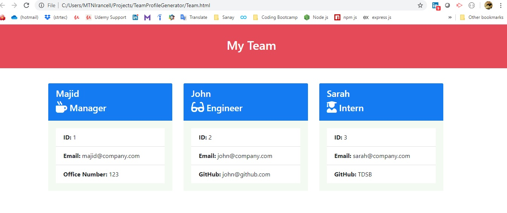

# TeamProfileGenerator


## User Story

```
As a manager
I want to generate a webpage that displays my team's basic info
so that I have quick access to emails and GitHub profiles
```
## Test

The dependencies are, [jest](https://jestjs.io/) for running the provided tests, and [inquirer](https://www.npmjs.com/package/inquirer) for collecting input from the user.

There are also unit tests to help you build the classes necessary.

It is recommended that you follow this workflow:

1. Run tests
2. Create or update classes to pass a single test case
3. Repeat

🎗 Remember, you can run the tests at any time with `npm run test`

It is recommended that you start with a directory structure that looks like this:

```
lib/           // classes and helper code
output/        // rendered output
templates/     // HTML template(s)
test/          // jest tests
  Employee.test.js
  Engineer.test.js
  Intern.test.js
  Manager.test.js
app.js         // Runs the application
```


 ## Reslts Screenshots:





### Classes
The project have these classes: `Employee`, `Manager`, `Engineer`, `Intern`. 
The tests for these classes in the `tests` directory must all pass.

The first class is an `Employee` parent class with the following properties and
methods:

  * name
  * id
  * title
  * getName()
  * getId()
  * getEmail()
  * getRole() // Returns 'Employee'

The other three classes will extend `Employee`. 

In addition to `Employee`'s properties and methods, `Manager` will also have:

  * officeNumber

  * getRole() // Overridden to return 'Manager'

In addition to `Employee`'s properties and methods, `Engineer` will also have:

  * github  // GitHub username

  * getGithub()

  * getRole() // Overridden to return 'Engineer'

In addition to `Employee`'s properties and methods, `Intern` will also have:

  * school 

  * getSchool()

  * getRole() // Overridden to return 'Intern'

### User input

The project must prompt the user to build an engineering team. An engineering
team consists of a manager, and any number of engineers and interns.

### Roster output

The project must generate a `team.html` page in the `output` directory, that displays a nicely formatted team roster. Each team member should display the following in no particular order:

  * Name

  * Role

  * ID

  * Role-specific property (School, link to GitHub profile, or office number)

